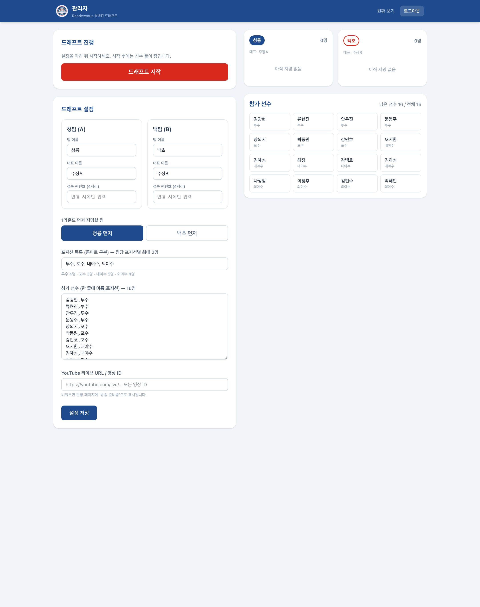
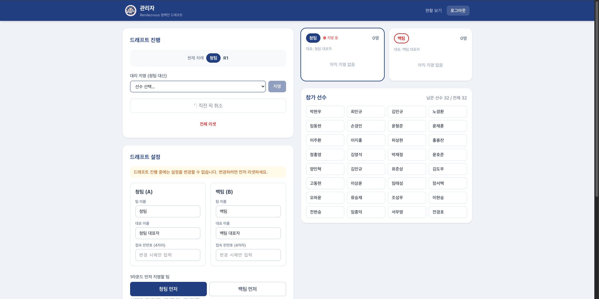
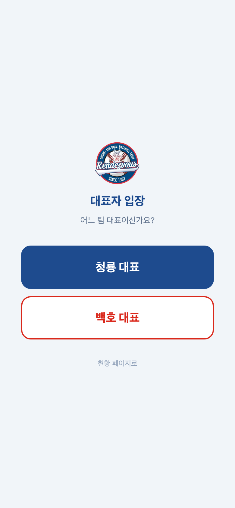
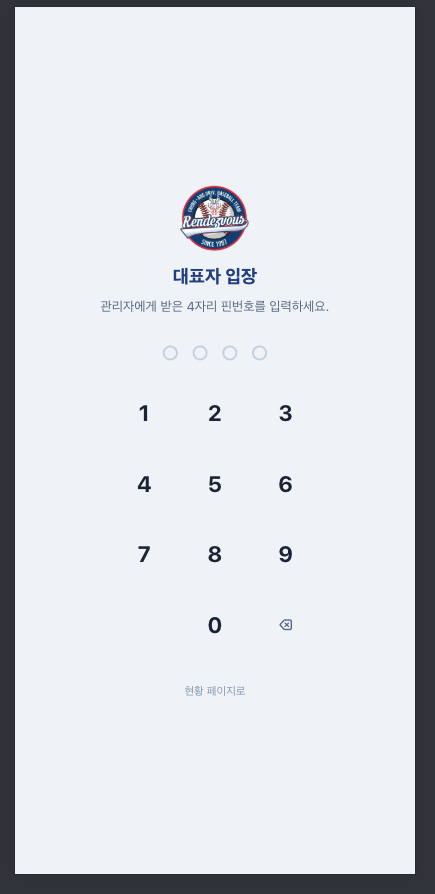
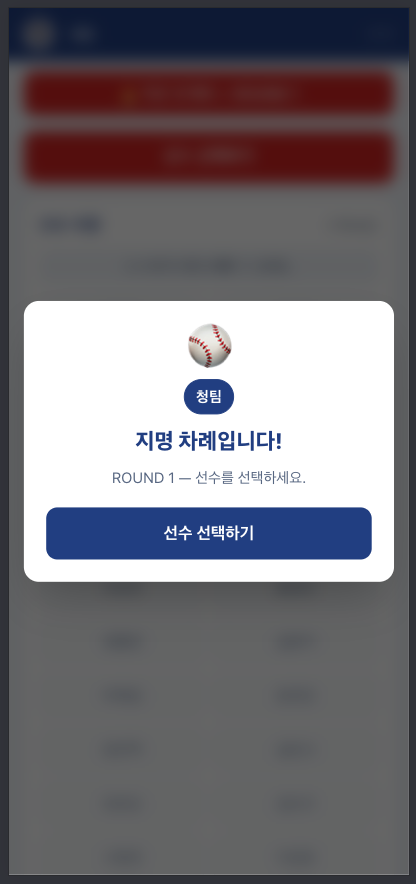
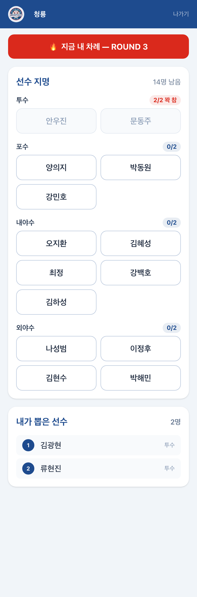
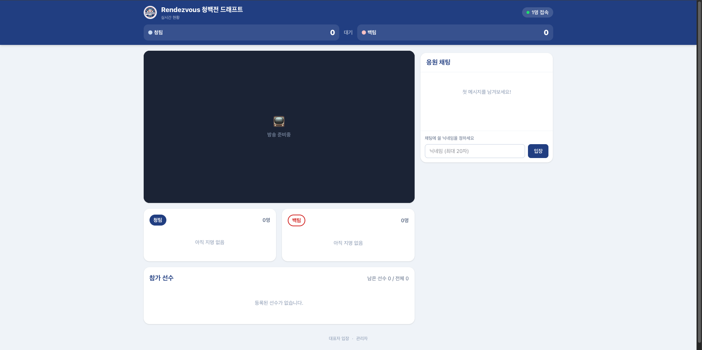
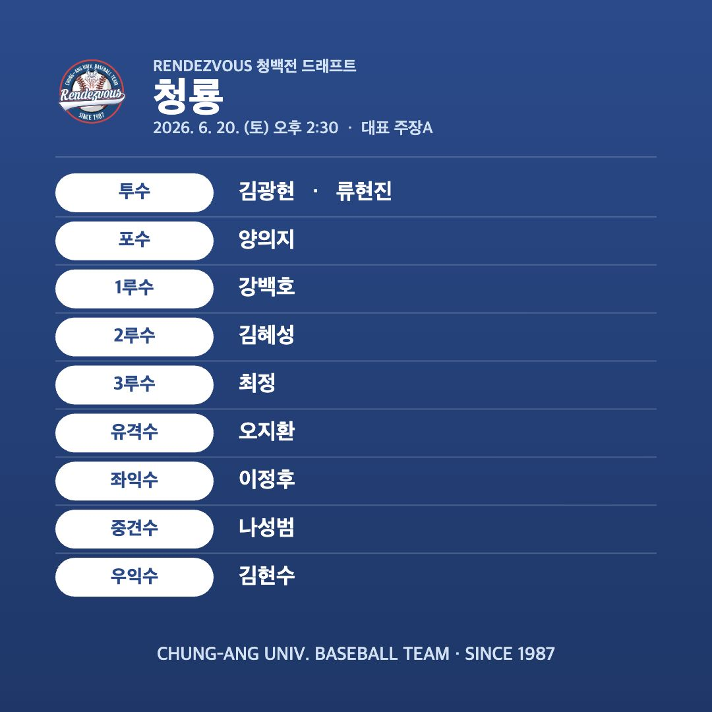
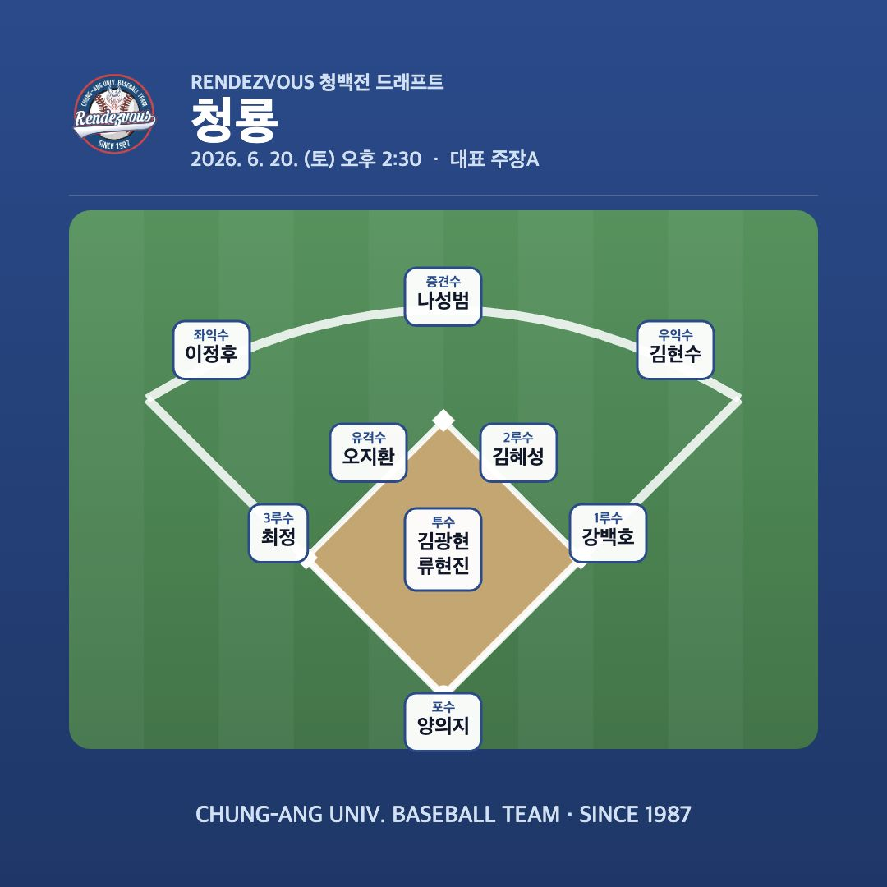
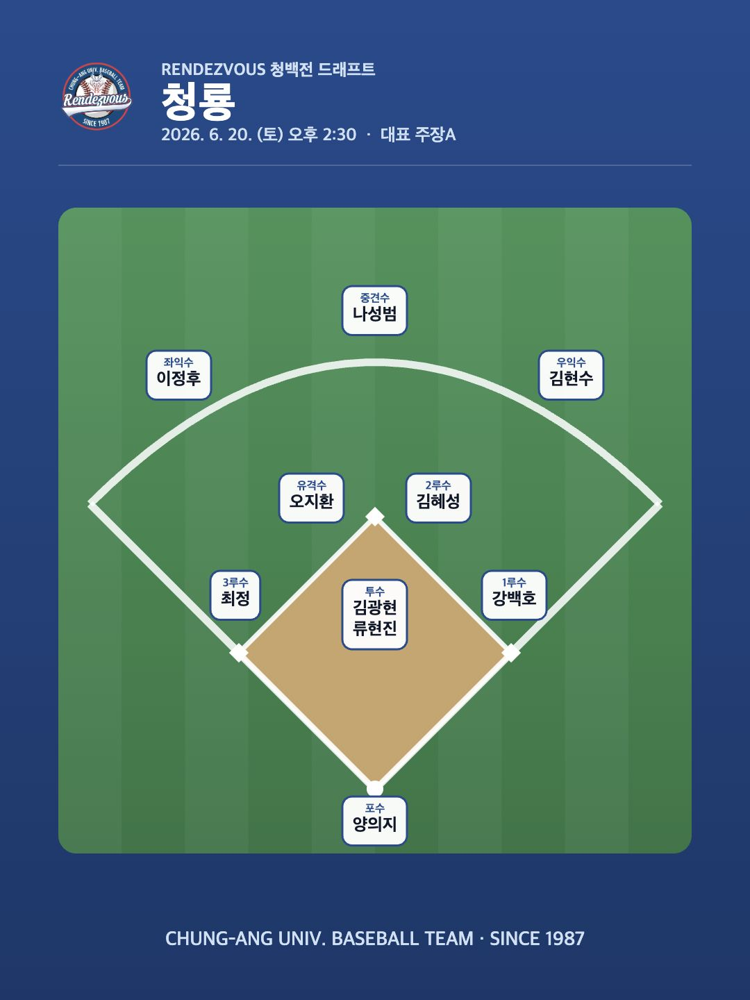

<div align="center">
  
  <h1>Rendezvous 청백전 드래프트 — 사용설명서</h1>
  <p>중앙대 야구 동아리 청백전 선수 드래프트를 휴대폰·PC에서 실시간으로 진행하는 사용 매뉴얼입니다.</p>
</div>

> 이 문서는 **실제 행사 진행/사용** 안내입니다. 설치·Firebase 설정·배포는 [README](../README.md)를 참고하세요.

---

## 목차
1. [한눈에 보기 (역할과 화면)](#1-한눈에-보기-역할과-화면)
2. [행사 전 준비 — 관리자](#2-행사-전-준비--관리자)
3. [드래프트 진행 — 관리자](#3-드래프트-진행--관리자)
4. [선수 지명 — 대표자(모바일)](#4-선수-지명--대표자모바일)
5. [관전 & 응원 — 현황 화면](#5-관전--응원--현황-화면)
6. [드래프트 종료 & 결과 내보내기](#6-드래프트-종료--결과-내보내기)
7. [드래프트 규칙 요약](#7-드래프트-규칙-요약)
8. [자주 묻는 질문 / 문제 해결](#8-자주-묻는-질문--문제-해결)

---

## 1. 한눈에 보기 (역할과 화면)

세 종류의 화면이 있고, 같은 드래프트를 실시간으로 공유합니다. 한 곳에서 일어난 변화가 모든 화면에 즉시 반영됩니다.

| 화면 | 주소 | 대상 | 기기 | 접근 |
|---|---|---|---|---|
| **현황** | `/` | 모두(관전자) | PC·모바일 | 자유 |
| **대표자** | `/team` | 양 팀 대표 | 모바일 | 4자리 핀번호 |
| **관리자** | `/admin` | 진행자 | PC | 이메일/비밀번호 |

> 주소는 배포 도메인 기준입니다. 예: `https://<프로젝트>.web.app/`, `.../team`, `.../admin`

**진행 한눈에:** 관리자가 설정·시작 → 대표가 휴대폰으로 순서대로 지명 → 관전자가 현황에서 시청·응원 → 완료되면 팀별 명단을 이미지로 저장.

---

## 2. 행사 전 준비 — 관리자

`/admin` 에 접속해 이메일/비밀번호로 로그인합니다.



**설정 순서 (드래프트 설정 패널):**

1. **팀 정보** — 청팀(A)·백팀(B)의 **팀 이름**과 **대표 이름** 입력
2. **접속 핀번호(4자리)** — 팀별로 지정 → 각 팀 대표에게 전달 (대표 입장용)
3. **경기 날짜 및 시작 시간** — 날짜·시간을 선택하면 요일이 자동 계산되고 최종 명단 이미지에 함께 표시
4. **1라운드 먼저 지명할 팀(선픽)** 선택
5. **포지션 목록** — 콤마로 직접 정의
   - 예) `투수, 포수, 내야수, 외야수` 또는 `투수, 포수, 1루수, 2루수, 3루수, 유격수, 좌익수, 중견수, 우익수`
6. **참가 선수 명단** — 한 줄에 **`이름,포지션`** 형식으로 입력
   ```
   김광현,투수
   양의지,포수
   오지환,내야수
   나성범,외야수
   ```
   - 입력하면 포지션별 인원이 미리보기로 표시됩니다.
   - ⚠️ 모든 선수의 포지션은 위 **포지션 목록 안에** 있어야 합니다(아니면 시작 시 알려줍니다).
7. (선택) **YouTube 라이브 URL/영상 ID** — 현황 화면에 중계 영상으로 표시
8. **[설정 저장]** 클릭 → 우측 라이브 미러에서 팀·선수 풀 확인

> 💡 **핀번호 안내:** 두 팀 핀이 같아도 됩니다. 대표는 입장 시 **팀을 직접 선택**하므로 헷갈리지 않습니다.

---

## 3. 드래프트 진행 — 관리자

설정을 마쳤으면 **[드래프트 시작]**. 시작하면 선수 풀·포지션 설정이 **잠깁니다**(실수 방지). 바꾸려면 먼저 리셋해야 합니다.



진행 중 컨트롤:

| 버튼 | 설명 |
|---|---|
| **현재 차례** | 지금 지명할 팀과 라운드 표시 |
| **대리 지명** | 대표가 자리에 없을 때 관리자가 대신 선수 지명 |
| **직전 픽 취소** | 잘못된 지명을 한 번에 되돌리기(undo) |
| **전체 리셋** | 모든 지명 취소 후 설정 단계로 복귀 |

> 🔁 **자동 스킵:** 어느 팀 차례인데 남은 선수가 전부 그 팀이 이미 2명 채운 포지션이면, 그 팀 차례는 **자동으로 건너뜁니다**. 양 팀 모두 더 못 뽑으면 드래프트가 **자동 종료**됩니다.

---

## 4. 선수 지명 — 대표자(모바일)

각 팀 대표는 휴대폰으로 `/team` 에 접속합니다.

| ① 팀 선택 | ② 핀 입장 | ③ 내 차례 알림 | ④ 포지션별 지명 |
|:---:|:---:|:---:|:---:|
|  |  |  |  |

1. **팀 선택** — "어느 팀 대표이신가요?"에서 본인 팀 선택
2. **핀 입장** — 관리자에게 받은 4자리 핀 입력
3. **내 차례 알림** — 순서가 되면 "지명 차례입니다!" 팝업 → **[선수 선택하기]**
4. **포지션별 지명** — 선수가 포지션 그룹으로 묶여 표시됩니다.
   - 우리 팀이 이미 2명 채운 포지션은 **`2/2 꽉 참`** 으로 **비활성**(선택 불가)
   - 선수를 누르면 **확인 팝업**("○○ 선수를 지명하시겠습니까?") → **[지명 확정]**
5. **내가 뽑은 선수** — 화면 아래에서 라운드 순서로 확인

> ✅ 내 차례가 아닐 때는 선택이 비활성화됩니다. 잘못 눌러도 확인 단계가 막아주고, 관리자가 즉시 되돌릴 수 있습니다.

---

## 5. 관전 & 응원 — 현황 화면

누구나 `/` 에 접속하면 로그인 없이 실시간으로 시청할 수 있습니다. PC·모바일 모두 지원합니다.



- **스코어보드** — 팀별 지명 수, 현재 라운드, 지금 지명 중인 팀
- **라이브 영상** — 관리자가 등록한 YouTube 라이브 (없으면 "방송 준비중")
- **팀별 로스터** — 지명 선수를 라운드·포지션과 함께 표시
- **참가 선수 풀** — 남은/전체 인원, 지명되면 팀 뱃지로 표시
- **접속자수** — 지금 보고 있는 인원 실시간 표시
- **대형 지명 발표 팝업** — 새 선수가 뽑히면 화면 전체에 크게 발표
- **응원 채팅** — 닉네임만 정하면 누구나 참여 (도배 방지: 너무 빨리 보내면 잠시 대기)
  - 항상 **최신 메시지가 하단**에 표시되고, 가득 차면 스크롤로 이전 대화를 볼 수 있습니다.
  - 위로 올려 읽는 중에는 새 채팅이 와도 **보던 위치가 유지**되며, **「새 메시지 N개 ↓」** 버튼으로 최신 위치로 이동합니다.

> 📺 대형 스크린에 현황 화면을 띄워두면 현장 중계 화면으로 활용할 수 있습니다.

---

## 6. 드래프트 종료 & 결과 내보내기

모든 선수가 배정되거나 양 팀 모두 더 뽑을 수 없으면 드래프트가 종료되고, 현황·관리자 화면 위쪽에 **최종 명단**이 나타납니다.

**표 / 그라운드 두 가지 보기**를 토글할 수 있습니다.

| 표 보기 | 그라운드 보기 |
|:---:|:---:|
|  |  |

- **표 보기**는 로고·팀명 영역을 간결하게 배치하고, 핵심 정보인 포지션명과 선수명을 크게 표시합니다.
- **그라운드 보기**는 포지션을 실제 야구 수비 위치에 배치합니다(투수·포수·1루·유격·좌익… 및 내야수/외야수 묶음 지원).
  - 홈에서 좌우 파울라인이 **90도**로 만나며, 2루에서 1루·3루 연결선도 **90도**로 만나는 야구장 다이아몬드 비율을 유지합니다.
- **[이미지 저장]** 으로 팀별 명단을 PNG로 내보낼 수 있습니다.
  - **비율 선택: 1:1**(SNS 피드) / **3:4**(세로) — 9포지션은 3:4가 여유롭습니다.
  - 청팀=네이비, 백팀=화이트+레드. 로고·팀명과 관리자가 설정한 **요일·날짜·시작 시간** 포함.

<p align="center">
  
</p>

---

## 7. 드래프트 규칙 요약

- **순서: 스네이크** — `1R 청·백 → 2R 백·청 → 3R 청·백 …` 라운드마다 순서가 뒤집혀 공정합니다.
- **포지션 캡** — 선수는 포지션별로 나뉘고, **한 팀은 같은 포지션을 최대 2명**까지만 뽑습니다.
- **자동 스킵 & 종료** — 더 못 뽑는 팀 차례는 건너뛰고, 양 팀 모두 불가하면 종료.
- **공정성 보장** — 차례·포지션 캡·중복은 서버에서 검증되어, 차례가 아니거나 포지션이 꽉 차면 지명 자체가 막힙니다.

---

## 8. 자주 묻는 질문 / 문제 해결

**Q. 대표가 핀을 입력했는데 안 넘어가요.**
→ 관리자가 해당 팀 핀번호를 **저장**했는지 확인하세요(설정 저장). 팀을 잘못 골랐다면 "← 팀 다시 선택".

**Q. 현황 화면이 "불러오는 중"에서 멈춰요.**
→ (배포 직후라면) Firestore **보안 규칙이 배포**됐는지 확인하세요. 자세한 내용은 [README](../README.md)의 배포 항목 참고.

**Q. 대표 화면에서 선수가 안 눌려요.**
→ ① 내 차례가 아니거나, ② 그 포지션을 이미 **2명**(`2/2 꽉 참`) 채웠습니다. 다른 포지션을 선택하세요.

**Q. 채팅이 안 보내져요.**
→ 너무 빠르게 연속 전송하면 잠깐(수 초) 대기 후 다시 전송됩니다(도배 방지).

**Q. 잘못 지명했어요.**
→ 관리자 화면에서 **[직전 픽 취소]** 로 되돌립니다.

**Q. 처음부터 다시 하고 싶어요.**
→ 관리자 **[전체 리셋]** → 설정 단계로 돌아갑니다(선수 풀·포지션 다시 편집 가능).

**Q. 동시에 몇 명까지 볼 수 있나요?**
→ 동시 접속 **약 100명**까지를 기준으로 운영합니다.

---

<div align="center">
  <sub>Rendezvous 청백전 드래프트 · CHUNG-ANG UNIV. BASEBALL TEAM · SINCE 1987</sub>
</div>
